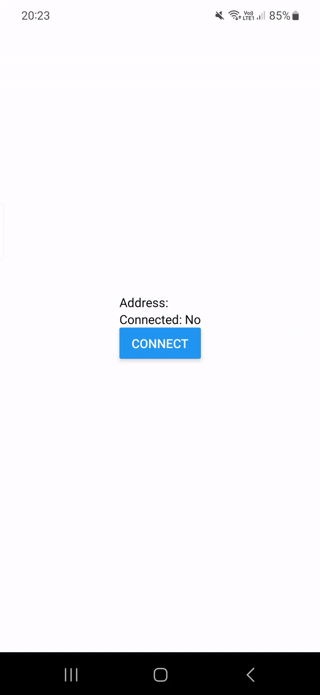

# Expo Dapp with WalletConnect

This repository is a demo project that demonstrates how to use WalletConnect with Expo and React Native. The project does not require prebuilt or ejected apps.

## Demo



## Getting Started

To get started, you will need to have the Expo CLI installed on your system. You can install it by running the following command:

```bash
npm install -g expo-cli
```

Once you have the Expo CLI installed, clone the repository and navigate to the project's root directory.

```bash
git clone https://github.com/ManueleNolli/ExpoDapp-WalletConnect.git
cd ExpoDapp-WalletConnect
```

Install the project's dependencies.

```bash
npm install
```

Start the project.

```bash
npx expo start
```

This will launch the Expo development server. You can use the Expo app on your phone or an emulator to view the app.

## Configuration

The app uses `global.ts` for global configuration that **must** be set before running the app:

```typescript
include "./global.ts"
```

The app also uses `metro-config.js` to customize the Metro bundler configuration. The metro-config.js file exports a function that modifies the Metro bundler's default configuration. This configuration is required to ensure that WalletConnect works correctly.

## Contributing
If you find any issues with the app or have suggestions for improvements, feel free to open an issue or submit a pull request. We welcome contributions from the community.